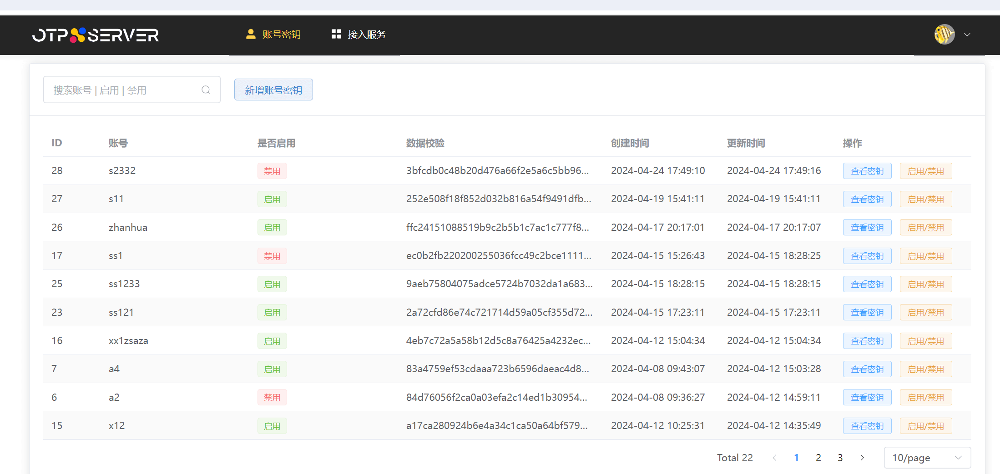
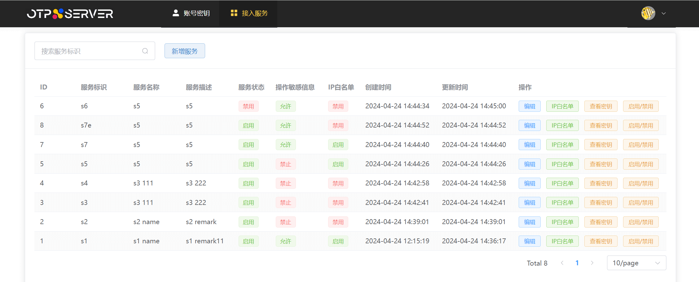

## 开始使用

### 说明

通过简单配置即可直接线上运行

### 下载

| 文件                                                | 系统      | CPU架构  | 大小     | SHA256 Checksum                                                  |
|:--------------------------------------------------|:--------|:-------|:-------|:-----------------------------------------------------------------|
| [otpserver-linux-amd64.zip](download/otpserver-linux-amd64.zip)     | Linux   | x86-64 | 11.0MB | 4a9dfd226f83266352882b0a50fe4935d91824ae7d488274d6f6e6625e5f3afa | 
| [otpserver-macos-amd64.zip](download/otpserver-macos-amd64.zip)     | macOS   | x86-64 | 11.4MB | 08b4a172380c987019e1e438c9b0884e37613c470cf45c63cdbcbde46620bbeb | 
| [otpserver-macos-arm64.zip](download/otpserver-macos-arm64.zip)     | macOS   | M系列 | 11.1MB | f514bc160f067b93663df8772ff7d4d85b4faf39df7037e11eff5f8430c401d5 | 
| [otpserver-windows-amd64.zip](download/otpserver-windows-amd64.zip)     | Windows   | x86-64 | 11.0MB | 524f99f58bad10c0e0277ea5c55eef6351ac77ff8b4f68bf55f40531277066be | 

示例：wget下载

``` shell
wget https://github.com/lidenger/otpserver/raw/main-doc/doc/download/otpserver-linux-amd64.zip
```

### 解压

#### 1. 解压（这里以linux为例）

```shell
unzip linux-amd64.zip

-rw-r--r-- 1 root root  30M May  9 20:00 app
-rw-r--r-- 1 root root 1.6K May  9 19:42 app.toml
-rw-r--r-- 1 root root 5.6K May  8 20:00 mysql-otp.sql
-rw-r--r-- 1 root root  354 Apr 22 14:50 nacos.toml
-rw-r--r-- 1 root root  11K May  8 20:04 pgsql-otp.sql
```

#### 2. app文件授权可执行：(Windows系统解压即可执行，无需操作)

```shell
chmod +x app

-rw-r--r-- 1 root root  30M May  9 20:00 app
...
```

#### 3. 文件说明

- app 可执行文件
- app.toml 系统启动配置文件，如果从Nacos配置中心启动可删除该文件
- nacos.toml 如果需要从Nacos配置中心加载配置需要在该文件中设置Nacos server地址，如果从本地配置文件启动可删除该文件
- mysql-otp.sql MySQL创建库表语句，如果不使用MySQL可删除该文件
- pgsql-otp.sql PostgreSQL创建库表语句，如果不使用PostgreSQL可删除该文件

### 配置

这里选择简单方式启动：
本地启动 + MySQL存储
<br>
MySQL信息如下:

```text
链接地址: 127.0.0.1:3306
数据库为：otp
账号： root
密码：12345678
```

#### 1. 创建数据库

```text
数据库名：otp
字符集：utf8mb4
排序规则：utf8mb4_general_ci
```

#### 2. 在otp库执行mysql-otp.sql创建表结构

#### 3. 系统初始化

```shell
./app -init
## 系统初始化模式
## 系统启动文件[app.key]在当前目录生成完成，该文件为敏感文件请妥善保管
```

#### 4. 更新MySQL相关配置

- 加密数据库密码

```shell
./app -encrypt -data "12345678"
##加密模式
##数据:12345678,加密后密文:0e6a6c85007f284da9cc083aa054786d
```

- 更新本地配置文件 (app.toml)

```text
...
[mysql]
address = "127.0.0.1:3306"
userName = "root"
"password@cipher" = "0e6a6c85007f284da9cc083aa054786d"
dbName = "otp"
...
```

#### 5. 初始化admin管理后台账号密码

```shell
./app -admin -password "123456"

##Admin账号密码创建成功,账号:admin,密码:123456
```

#### 6. 修改服务域名配置

```shell
[server]
...
# 例如我们的域名为otpserver.com(如果是本地启动可以配置为localhost)
# 需要注意的是：正确配置域名才能登陆管理后台
domain = "otpserver.com"
...
```

#### 7. 启动服务

```shell
./app

##{"level":"info","time":"2024-05-09 20:29:41","caller":"log/config.go:49","func":"github.com/lidenger/otpserver/config/log.Info","msg":"Http服务已启动,端口:[8066]"}
```

#### 8. 浏览器输入配置的域名登陆管理后台

<br>
 <br>

